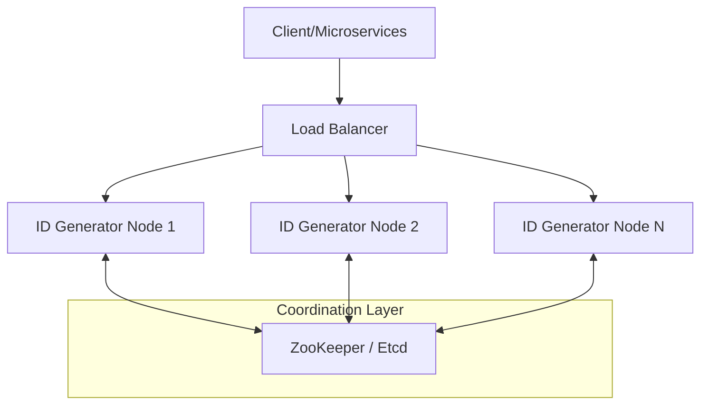

# Distributed ID Generator (Snowflake Service)

A high-performance, scalable, and decentralized ID generation service based on the **Twitter Snowflake** algorithm. This service generates 64-bit unique identifiers that are k-sortable (approximately ordered by time) without requiring a central database for coordination.

---

## 1. High-Level Architecture

The system is designed to be stateless and highly available, ensuring that ID generation is never a bottleneck in a distributed system.

### Component Map
- **Client/Microservices**: Applications that request unique IDs (e.g., Tweet Service, Order Service).
- **API Gateway / Load Balancer**: Distributes incoming requests across multiple ID Generator nodes.
- **ID Generator Nodes**: Lightweight workers that perform the bitwise math to generate IDs in memory.
- **Coordination Service (ZooKeeper/Etcd)**: Manages node registration and ensures unique `Worker ID` assignment.



---

## 2. The ID Format (Snowflake Blueprint)

Instead of random strings or UUIDs, we use a **64-bit Long (BigInt)**. This format is database-friendly (indexed faster) and time-ordered.

| Segment | Bits | Purpose |
| :--- | :--- | :--- |
| **Sign Bit** | 1 bit | Always `0` to ensure the number is positive. |
| **Timestamp** | 41 bits | Milliseconds elapsed since the **Custom Epoch**. |
| **Worker ID** | 10 bits | Unique identifier for the server (supports up to 1,024 nodes). |
| **Sequence** | 12 bits | Local counter for IDs created within the same millisecond (up to 4,096 IDs/ms). |

### Bit Breakdown
```text
 0 | 0000000000 0000000000 0000000000 0000000000 0 | 0000000000 | 000000000000
--- | ------------------------------------------ | ---------- | ------------
Sign|                Timestamp (41b)             | Worker(10b)| Sequence(12b)
```

---

## 3. Deep Dive: How the Service Works

### A. The Coordination Layer (ZooKeeper)
To solve the "Who am I?" problem in a cluster, we use ZooKeeper for cluster management:
1. **Registration**: When a node starts, it connects to ZooKeeper and requests a `Worker ID`.
2. **Assignment**: ZooKeeper assigns a unique ID (0-1023) and maintains a heartbeat.
3. **Fault Tolerance**: If a node crashes, ZooKeeper releases the ID after a session timeout, allowing a replacement node to take over.

### B. Generation Logic
When a request is received by a node:
1. **Timestamp**: Get current system time (ms) and subtract the `Custom Epoch`.
2. **Sequence Check**:
    - If `currentTime == lastTimestamp`, increment the `Sequence`.
    - If `Sequence` overflows (4095), wait for the next millisecond.
3. **Concatenation**: Perform bit-shift operations to combine the components into a single 64-bit integer.

---

## 4. Handling Critical Edge Cases

### 1. Clock Skew (Time Travel)
NTP (Network Time Protocol) can sometimes sync the clock backwards.
- **Problem**: Moving backward could result in duplicate IDs for the same timestamp/sequence.
- **Solution**: The service stores the `LastTimestamp`. If `CurrentTimestamp < LastTimestamp`, the node refuses to generate IDs (throws an exception) until the clock catches up.

### 2. High Availability
The service is inherently horizontally scalable.
- **Strategy**: Multiple nodes run independently. Since their `Worker IDs` are unique, they can generate IDs without communicating with each other, eliminating a single point of failure (SPOF).

### 3. The "69-Year" Problem
41 bits of timestamp provide $\approx 69.7$ years of coverage from the epoch.
- **Optimization**: Set a `Custom Epoch` (e.g., April 2024). This resets the "clock" to zero at deployment time, extending the service life until the year 2093.

---

## 5. MySQL Auto-Increment vs. Snowflake

| Feature | MySQL Auto-Increment | Snowflake ID |
| :--- | :--- | :--- |
| **Scalability** | Single DB bottleneck | Highly Scalable (Stateless) |
| **Latency** | Network hop to DB | In-memory (~1ms) |
| **Format** | Sequential Integers | k-sortable Long |
| **Coordination** | Centralized | Decentralized |

> [!TIP]
> **Global Scale Adaptation**: For multi-region deployments, the 10-bit Worker ID can be split into 5 bits for **Datacenter ID** and 5 bits for **Worker ID**, supporting 32 datacenters with 32 workers each.
