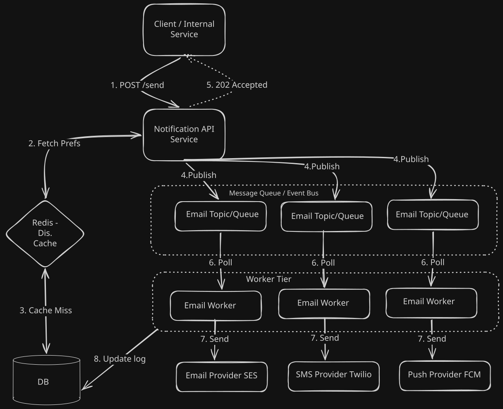

# Distributed Notification System 🔔

A scalable, reliable, and fault-tolerant system design for delivering real-time notifications across multiple channels (Email, SMS, Push, In-App).

---

## 🏗️ Step 1: Requirements & Channel Analysis

Before designing the system, we must define what we are building and the channels we support.

### ✅ Functional Requirements (FR)
* **Multi-Channel Delivery:** The system must support Email, SMS, Push Notifications (iOS/Android), and In-App messages.
* **User Preferences:** Users can opt-in or opt-out of specific channels or categories (e.g., receive transactional alerts but block promotional emails).
* **Prioritization:** The system must differentiate between critical alerts (e.g., OTPs, Security warnings) and bulk messages (e.g., Marketing newsletters).
* **Status Tracking:** Track delivery statuses (Sent, Delivered, Read, Bounced).

### ⚙️ Non-Functional Requirements (NFR)
* **High Reliability (No Data Loss):** A notification, once accepted, must not be lost. If it fails, it must be retried.
* **Low Latency for Critical Alerts:** OTPs and transaction alerts must be delivered in under 3 seconds.
* **High Throughput for Bulk:** Must be capable of pushing millions of background promotional messages efficiently.
* **Idempotency:** Prevent duplicate notifications, especially for billing or payment alerts.
* **Rate Limiting:** Protect third-party providers (like Twilio or SendGrid) from being overwhelmed.

---

## 🏛️ Step 2: Distributed Architecture (The Role of Kafka/RabbitMQ)

To handle high throughput and decouple the core application from external third-party APIs, we introduce an asynchronous, event-driven architecture using **Message Queues (Kafka or RabbitMQ)**.

### 🧱 Component Breakdown
1. **Notification API (Gateway):** The entry point for internal microservices to request a notification. It performs basic validation and rate-limiting.
2. **User Preferences Cache / DB:** Checks if the user is opted-in and resolves contact info (phone number, email, device token).
3. **The Message Broker (Kafka / RabbitMQ):** Acts as the shock absorber. It decouples the fast API servers from the slower, third-party network calls.
    * *Why RabbitMQ?* Great for complex routing, priority queues, and delayed retries.
    * *Why Kafka?* Incredible throughput, ideal for massive bulk streams (100M+ promo emails) and robust replayability.
4. **Channel Workers (Consumers):** Independent microservices subscribed to specific queues (e.g., `Email-Worker`, `SMS-Worker`). They pull messages and call external APIs (SendGrid, Twilio, APNs, FCM).

> [!NOTE] 
> **Decoupling is Key:** By placing a queue between the API and the Workers, if the external SMS provider goes down, our internal services are unaffected. Messages simply queue up until the provider is back online.

---

## 🚦 Step 3: Prioritization Logic (High-Priority vs. Bulk Queues)

Not all notifications are created equal. A password reset email cannot be stuck behind 2 million promotional newsletters.

### Queue Segregation Strategy
To prevent head-of-line blocking, we separate traffic logically and physically:

* **High-Priority Queues (The "Fast Lane"):**
    * **Use Case:** OTPs, Security Alerts, Payment Confirmations.
    * **Setup:** Dedicated queues with isolated consumer groups. These workers are strictly reserved for urgent messages.
    * **SLA:** Delivery within 1-3 seconds.

* **Standard / Bulk Queues:**
    * **Use Case:** Marketing materials, weekly digests.
    * **Setup:** Separate queues handled by a larger pool of workers that process messages in batches.
    * **SLA:** Delivery within minutes to hours.

### Rate Limiting the Bulk Output
Third-party providers (APNs, SendGrid) impose strict rate limits. Our Bulk Workers must enforce distributed rate-limiting (e.g., via Redis Token Bucket algorithms) to ensure we don't get IP-banned or severely throttled by the vendors.

---

## 🛡️ Step 4: Dealing with Failure (Retries, Exponential Backoff, & Dead Letter Queues)

Failures in distributed systems are guaranteed. External APIs rate limit, networks partition, and user devices go offline.

### 🔄 1. The Retry Mechanism & Exponential Backoff
If a worker fails to send an SMS because Twilio returns an `HTTP 429 Too Many Requests` or a `50x Server Error`, the worker should not discard the message. 
* It places the message into a **Delayed Retry Queue**.
* **Exponential Backoff:** Hard-retrying immediately will just hammer the failing API. Instead, we wait progressively longer between attempts: *Wait 2s → 4s → 8s → 16s → 32s*.

### 🚫 2. Dead Letter Queues (DLQ)
If a message fails repeatedly and exhausts its maximum retry count (e.g., 5 attempts), or if it encounters a fatal error (like a "Hard Bounce" invalid email address), it is routed to a **Dead Letter Queue (DLQ)**.
* **Purpose:** Prevents "poison pill" messages from clogging the main queues. Data in the DLQ can be analyzed later, used to update user profiles (e.g., marking an email as invalid), or manually re-queued.

### 🔑 3. Idempotency Keys
What if the SMS Worker successfully texts the user, but crashes before it can acknowledge (ACK) the message to RabbitMQ?
* The broker will assume failure and requeue the message. The user gets two texts.
* **Solution:** Create an **Idempotency Key** (a unique hash of the payload + user ID + timestamp) and store it in Redis. Before sending, the worker checks Redis: `EXISTS(hash)`. If true, skip processing. If false, process and `SET(hash, 24h)`.

---

## 🗓️ Progress Tracker

- [x] **Step 1:** Requirements & Channel Analysis
- [x] **Step 2:** Distributed Architecture (The Role of Kafka/RabbitMQ)
- [x] **Step 3:** Prioritization Logic (High-Priority vs. Bulk Queues)
- [x] **Step 4:** Dealing with Failure (Retries, Exponential Backoff, & Dead Letter Queues)
- [ ] **Step 5:** Implementation Blueprint (SOP) 
- [ ] **Step 6:** Proof of Concept (PoC) & Walkthrough
