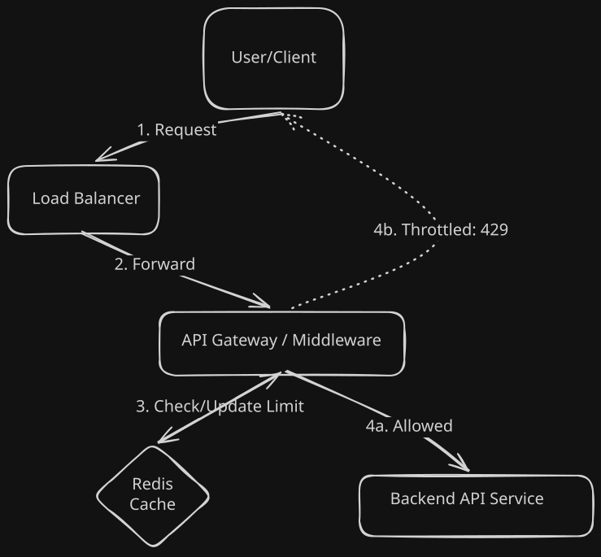

# Rate Limiter: System Design Deep Dive 🛡️

A Rate Limiter is a critical service used to control the rate of traffic sent by a client or a service. It protects APIs from being overwhelmed by too many requests (unintentional or malicious/DoS).

## 🏗️ 1. Requirements & Scope

Before designing, we must define the constraints of the system.

### ✅ Functional Requirements
* **Throttling:** Limit requests based on a unique identifier (e.g., User ID or IP Address).
* **Custom Thresholds:** Allow different users to have different rate limits.
* **Feedback:** Return a clear error message (`429 Too Many Requests`) when the limit is exceeded, including a Retry-After header.
* **Distributed Support:** The system must accurately track requests across a distributed cluster of servers.

### ⚙️ Non-Functional Requirements
* **Ultra-Low Latency:** The rate limiter is in the critical path of every request. It must add < 2ms of overhead.
* **High Availability:** If the rate limiter service fails, it should "fail open" (allow traffic) to ensure the core API remains reachable.
* **Fault Tolerance:** The system should not have a single point of failure.
* **Scalability:** Must support millions of users and thousands of requests per second.
* **Memory Efficiency:** Must store user limits efficiently to avoid massive infrastructure costs.


## 🏗️ Design Constraints

* **Users:** 10 million daily active users.
* **Request Data:** If we store a User_ID (8 bytes) and a Counter (4 bytes) in Redis, that is 12 bytes per user.
* **Total Memory:** $10M \times 12 \text{ bytes} \approx 120\text{ MB}$. This fits easily into a single Redis node, but we will use clustering for high availability.
---

## 🏗️ 2. High-Level Architecture: Where to Place the Limiter?

Before picking an algorithm, we must decide where the rate limiter lives. This choice significantly impacts scalability and system decoupling.

### ⚖️ Placement Trade-offs

| Placement | Pros | Cons | Decision |
| :--- | :--- | :--- | :--- |
| **Client-Side** | No server load; instant feedback. | Easily bypassed by malicious users; impossible to sync across devices. | ❌ **Rejected** (Security risk) |
| **Server-Side** | Full control; easy to implement within the app code. | Consumes application resources; tight coupling with business logic. | ⚠️ **Conditional** (Good for simple monoliths) |
| **API Gateway / Middleware** | Decouples throttling from logic; centralized management; scales independently. | Adds a minor network hop; slightly higher infrastructure complexity. | ✅ **Recommended** (Best for Microservices/Scale) |

### 🔄 The System Flow

---

## 🛠️ 3. Algorithm Comparison: Choosing the Right Strategy

There are several industry-standard algorithms. For this project, we have selected the **Token Bucket** algorithm as our primary choice.

### 1. Token Bucket (Our Choice) 🏆
* **Mechanism**: A bucket holds a maximum number of tokens. Each request consumes one token. Tokens are refilled at a constant rate (e.g., 10 tokens/second).
* **Pros**: Handles **traffic bursts** gracefully. Highly memory efficient.
* **Cons**: Requires tuning two parameters (Bucket Size vs. Refill Rate).
* **Used by**: Amazon (AWS), Stripe.

### 2. Leaky Bucket
* **Mechanism**: Requests enter a bucket and "leak" out at a strictly constant rate. If the bucket overflows, requests are dropped.
* **Pros**: Ideal for **smoothing out** spikes and protecting sensitive databases from sudden loads.
* **Cons**: Bursts are strictly disallowed, which may frustrate legitimate users during high-activity periods.

### 3. Fixed Window Counter
* **Mechanism**: Time is divided into fixed intervals (e.g., 1-minute windows). A counter is reset at the start of every window.
* **Pros**: Extremely simple to implement in Redis (`INCR` + `EXPIRE`).
* **Cons**: **The Edge Problem** — A user can exhaust their limit at the very end of one window and the very start of the next, effectively doubling the allowed rate in a few seconds.

### 4. Sliding Window Counter
* **Mechanism**: A hybrid approach that calculates a weighted average based on the current window and the previous window to smooth out "edge" spikes.
* **Pros**: Extremely accurate; prevents the double-dipping issue found in Fixed Windows.
* **Cons**: Slightly more complex logic; requires atomic Lua scripts in Redis to maintain performance.

## ⚖️ 4. Handling Distributed Systems (Race Conditions)

In a distributed environment where multiple API Gateway instances share a single Redis state, we encounter the **"Read-Modify-Write"** problem.

### 🚫 The Problem: Race Conditions
If two gateway instances handle a request for the same user at the exact same millisecond:
1. **Instance A** reads `tokens = 1`.
2. **Instance B** reads `tokens = 1`.
3. Both see that `tokens > 0`, so both allow the request.
4. Both decrement the count in Redis.
5. **Result:** Two requests were allowed when only one was available. The rate limit was breached.

### ✅ The Solution: Redis Lua Scripts
To solve this, we use **Lua Scripts** executed directly inside Redis. 
* **Atomicity:** Redis guarantees that a script runs as a single, uninterrupted operation. No other request can modify the data until the script finishes.
* **Performance:** It reduces the number of network roundtrips between the Gateway and Redis.

---

## 🚀 5. Implementation Blueprint (Spring Cloud Gateway SOP)

For this PoC, we are building a **Distributed Rate Limiter Middleware** using Spring Cloud Gateway (Reactive) and Redis.

### 🛠️ Technical Stack
* **Framework:** Spring Cloud Gateway (WebFlux / Non-blocking)
* **State Store:** Redis (using `ReactiveRedisTemplate`)
* **Concurrency:** Lua Scripting for atomic Token Bucket logic.
* **Language:** Java 21 (utilizing Virtual Threads for the reactive bridge).

### 📂 Project Structure
```text
src/main/java/com/sd/ratelimiter/
├── config/             # Redis & Gateway Configurations
├── filter/             # Custom Global Filter (The Brain)
├── service/            # Redis Lua Script Execution Logic
└── dto/                # Rate Limit Metadata (Limit, Remaining, Reset)
src/main/resources/
├── application.yml     # Route & Filter definitions
└── scripts/            # rate_limiter.lua (The Atomic Script)

```

## 🚀 6. Final Implementation & Walkthrough

The Rate Limiter Service implementation has been finalized using Spring Cloud Gateway and Redis with Lua scripts.

### 🏗️ Technical Highlights & GoF Patterns
- **Virtual Threads Integration:** Employs Java 21 Virtual Threads (`spring.threads.virtual.enabled: true`) over Spring WebFlux for maximum throughput with minimal machine overhead.
- **Atomic Concurrency Resolution:** To combat the distributed "Read-Modify-Write" race condition, bucket calculation natively evaluates using the atomic `token_bucket.lua` script embedded in Redis.

#### 🎯 GoF Design Patterns Used
- **Strategy Pattern:** Implemented at the core of the rate-limiting functionality. The application exposes a generic `RateLimitStrategy` interface, and currently utilizes a concrete `TokenBucketStrategy`.
  - **Why?** Rate limiting logic frequently changes depending on scale and abuse patterns. By using the Strategy Pattern, we physically decouple the `RateLimitGatewayFilterFactory` from the mathematical evaluation of the limit. If we ever need to switch to a "Leaky Bucket" or "Sliding Window" algorithm, we can simply define a new strategy bean to inject, strictly honoring the **Open-Closed Principle (OCP)** without modifying existing infrastructure.
- **Factory Method Pattern:** Implemented intrinsically via Spring's `AbstractGatewayFilterFactory`. 
  - **Why?** It handles the instantiation and configuration of Gateway Filters dynamically at startup based on the specific route arguments defined in the `application.yml`, allowing for decoupled and highly scalable route management.

### 🧪 Integration Testing Output
Triggering burst limits successfully results dynamically terminating with:
```http
HTTP/1.1 429 Too Many Requests
X-RateLimit-Retry-After: 1
```
Successful requests correctly propagate limits upstream:
```http
HTTP/1.1 200 OK
X-RateLimit-Remaining: 4
```

### 🛠️ How to Run Locally

#### Prerequisites
* Docker & Docker Compose
* JDK 21
* Maven

**Step 1: Spin up Infrastructure (Redis)**
Navigate to `rate-limiter-service`:
```bash
docker-compose up -d
```

**Step 2: Run the Gateway API**
```bash
mvn spring-boot:run
```

**Step 3: Verification Script**
```bash
for i in {1..7}; do curl -i http://localhost:8080/api/get; echo ""; done
```

---

## 🗓️ Progress Tracker
- [x] **Step 1:** Requirements Gathering
- [x] **Step 2:** High-Level Architecture & Placement Strategy
- [x] **Step 3:** Algorithm Comparison & Selection
- [x] **Step 4:** Handling Distributed Systems (Redis & Race Conditions)
- [x] **Step 5:** Implementation Blueprint (Spring Cloud Gateway SOP)
- [x] **Step 6:** Final Implementation & Walkthrough 🏁