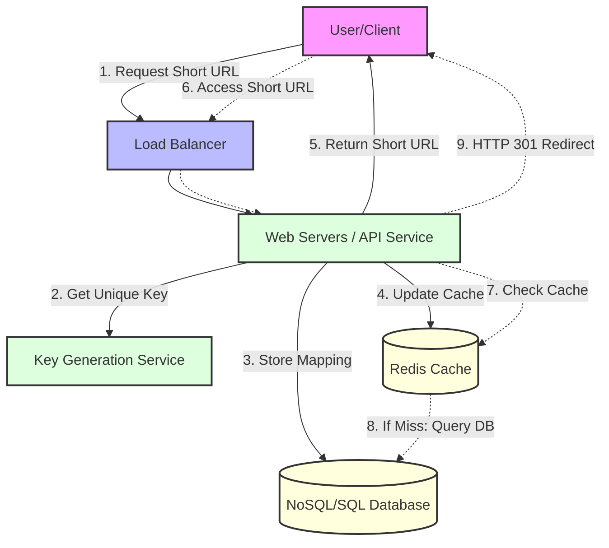

# URL Shortener (TinyURL) System Design 🔗

## 🏗️ Phase 1: Clarify Requirements

### ✅ Functional Requirements (FR)
* **Shortening:** Given a long URL, return a unique 7-character alias.
* **Redirection:** Clicking the short link redirects to the original long URL (HTTP 301/302).
* **Custom Aliases:** Users can specify a name (e.g., `bit.ly/my-portfolio`).
* **Expiration:** Links should expire after 2 years by default.

### ⚙️ Non-Functional Requirements (NFR)
* **High Availability:** Redirection must never fail (99.999% uptime).
* **Low Latency:** Redirection must happen in < 50ms.
* **Scalability:** Must support 100M new URLs/month and 10B clicks/month (Read-Heavy 100:1 ratio).
* **Uniqueness:** No two long URLs should produce the same short code.

## 🧮 2. Estimation

To design the right storage and caching layer, we must calculate the scale.

### Traffic Estimates
* **Write Volume:** 100 Million new URLs/month.
* **Read/Write Ratio:** 100:1 (Read-heavy).
* **Read QPS (Queries Per Second):** $$(100M \times 100 \text{ reads}) / (30 \text{ days} \times 86,400 \text{ sec}) \approx 4,000 \text{ RPS}$$
* **Write QPS:** $\approx 40 \text{ RPS}$

### Storage Estimates (5-Year Projection)
* **Total URLs:** $100M \times 12 \text{ months} \times 5 \text{ years} = 6 \text{ Billion URLs}$.
* **Average Record Size:** 500 bytes (URL + Hash + Metadata).
* **Total Storage Required:** $6B \times 500 \text{ bytes} \approx 3 \text{ Terabytes}$.

### Cache Estimates
* **Rule:** Cache 20% of the daily traffic (Pareto Principle).
* **Daily Requests:** $4,000 \text{ RPS} \times 86,400 \text{ sec} \approx 345 \text{ Million requests/day}$.
* **Cache Size:** $0.2 \times 345M \times 500 \text{ bytes} \approx 34 \text{ GB of RAM}$ for caching.

### System Flow Diagram

---

## 🗓️ Progress
- [x] Day 1: Requirements Gathering
- [ ] Day 2: High-Level Architecture (Hashing vs. Key Generation Service)
- [ ] Day 3: Database Schema & Storage Estimates
- [ ] Day 4: Caching & Redirection Flow
- [ ] Day 5: PoC Implementation