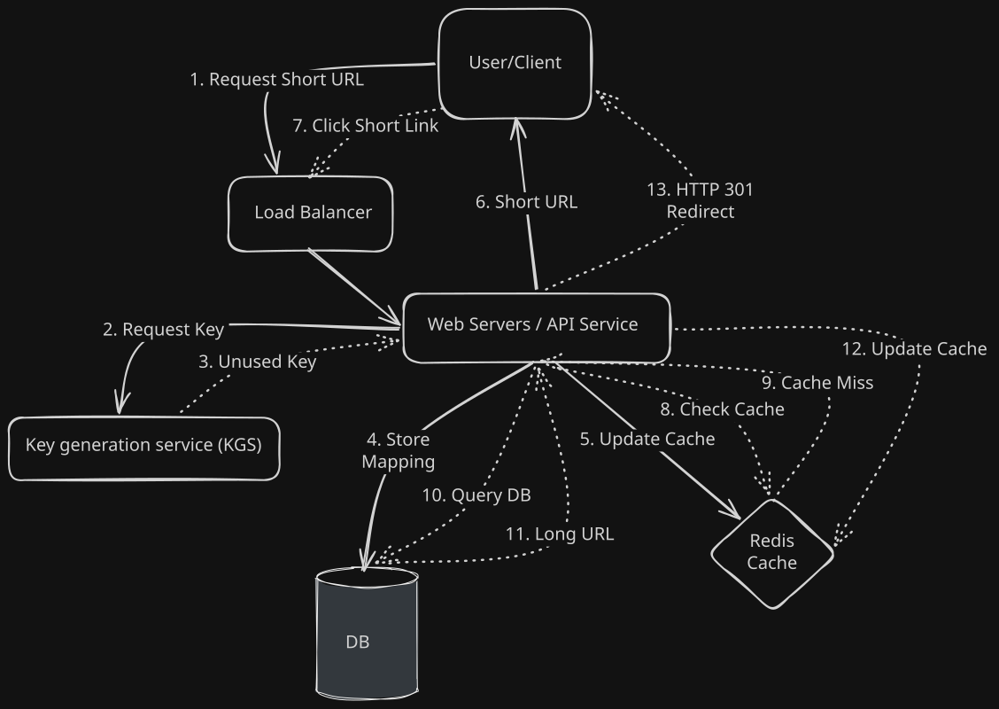

# URL Shortener (TinyURL) System Design 🔗

## 🏗️ Phase 1: Clarify Requirements

### ✅ Functional Requirements (FR)
* **Shortening:** Given a long URL, return a unique 7-character alias.
* **Redirection:** Clicking the short link redirects to the original long URL (HTTP 301/302).
* **Custom Aliases:** Users can specify a name (e.g., `bit.ly/my-portfolio`).
* **Expiration:** Links should expire after 2 years by default.

### ⚙️ Non-Functional Requirements (NFR)
* **High Availability:** Redirection must never fail (99.999% uptime).
* **Low Latency:** Redirection must happen in < 50ms.
* **Scalability:** Must support 100M new URLs/month and 10B clicks/month (Read-Heavy 100:1 ratio).
* **Uniqueness:** No two long URLs should produce the same short code.


## 🧮 2. Estimation

To design the right storage and caching layer, we must calculate the scale.

### Traffic Estimates
* **Write Volume:** 100 Million new URLs/month.
* **Read/Write Ratio:** 100:1 (Read-heavy).
* **Read QPS (Queries Per Second):** $$(100M \times 100 \text{ reads}) / (30 \text{ days} \times 86,400 \text{ sec}) \approx 4,000 \text{ RPS}$$
* **Write QPS:** $\approx 40 \text{ RPS}$

### Storage Estimates (5-Year Projection)
* **Total URLs:** $100M \times 12 \text{ months} \times 5 \text{ years} = 6 \text{ Billion URLs}$.
* **Average Record Size:** 500 bytes (URL + Hash + Metadata).
* **Total Storage Required:** $6B \times 500 \text{ bytes} \approx 3 \text{ Terabytes}$.

### Cache Estimates
* **Rule:** Cache 20% of the daily traffic (Pareto Principle).
* **Daily Requests:** $4,000 \text{ RPS} \times 86,400 \text{ sec} \approx 345 \text{ Million requests/day}$.
* **Cache Size:** $0.2 \times 345M \times 500 \text{ bytes} \approx 34 \text{ GB of RAM}$ for caching.

## 🏗️ 3. High-Level Design (HLD)

The system is designed to handle a read-heavy workload by decoupling the **Write Path** (URL Generation) from the **Read Path** (Redirection). 



### 🧱 Component Breakdown

* **Load Balancer (Nginx/AWS ELB):** Acts as the entry point. It distributes incoming traffic to multiple web servers using a *Least Connections* strategy to ensure no single server is overwhelmed during traffic spikes.
* **Web Servers (API Tier):** Stateless servers that handle the core logic. 
    * **Write:** Grabs a pre-allocated key from the KGS, stores the mapping, and updates the cache.
    * **Read:** Queries the cache first, falling back to the DB only on a cache miss.
* **Key Generation Service (KGS):** A dedicated microservice that pre-generates unique 7-character keys (Base62). 
    * *The "Why":* This eliminates runtime collisions and prevents the database from becoming a bottleneck during URL creation.
* **Cache (Redis):** Stores the most frequently accessed `short_url -> long_url` mappings. Based on the **Pareto Principle (80/20 rule)**, caching 20% of traffic can handle 80% of our requests, keeping redirection latency under 20ms.
* **Database (NoSQL/SQL):** The source of truth. At this scale, we optimize for high-availability and horizontal scaling. (See Phase 4 for the DB selection deep dive).

## 💾 4. Database Schema & Scaling (The SQL Approach)

While NoSQL is common for this use case, we are using **PostgreSQL** to leverage strong consistency (ACID) and robust indexing.

### Data Schema (`url_mappings` table)

| Column | Type | Constraints | Description |
| :--- | :--- | :--- | :--- |
| **id** | `BIGINT` | Primary Key | Internal unique ID |
| **short_key** | `VARCHAR(7)` | Unique Index | The 7-char Base62 alias |
| **original_url** | `VARCHAR(2048)` | NOT NULL | The destination URL |
| **user_id** | `INT` | Indexed | For user-based analytics |
| **created_at** | `TIMESTAMP` | Default NOW() | Creation timestamp |
| **expires_at** | `TIMESTAMP` | Indexed | TTL for automatic cleanup |

### 🚀 Scaling Postgres to 6 Billion Rows

A single Postgres instance cannot efficiently handle 3TB of data and 6 billion rows. To solve this, we implement **Database Sharding (Horizontal Partitioning)**.

#### 1. The Sharding Strategy
We will use **Hash-Based Sharding** on the `short_key`. 
* We calculate `hash(short_key) % N`, where `N` is the number of database shards (e.g., 16 shards).
* This ensures that data is evenly distributed across all database nodes, preventing "hot spots."

#### 2. Indexing Strategy
* **Unique Index on `short_key`:** This is the most frequent query path ($4,000 \text{ RPS}$).
* **Index on `expires_at`:** Required for a "Cleanup Worker" to efficiently find and delete expired links without scanning the whole table.

### ⚖️ Why SQL (Postgres) over NoSQL?
1. **ACID Compliance:** Ensures that a custom alias is never assigned to two different people simultaneously.
2. **Relational Power:** If we later want to add complex user features (billing, teams, folders), Postgres handles relations much better than Cassandra or DynamoDB.
3. **Maturity:** Excellent tooling for backups, replicas, and monitoring.


---

## 🚀 5. Implementation Blueprint (Spring Boot SOP)

For the Proof of Concept (PoC), we use Spring Boot 3.x with Java 21. The application follows a Layered Architecture to ensure separation of concerns, high performance, and testability.

### 🛠️ Technical Stack

| Component | Technology | Reasoning |
| :--- | :--- | :--- |
| **Framework** | Spring Boot 3.x | Industry standard for microservices and rapid PoC. |
| **Language** | Java 21 | Utilizing Virtual Threads (Project Loom) for high-concurrency performance. |
| **Database** | PostgreSQL | Primary store for ACID compliance and indexed lookups. |
| **Caching** | Redis | Sidecar cache to ensure sub-20ms redirects for popular links. |
| **Build Tool** | Maven/Gradle | Standard dependency management. |

### 📂 Project Structure (The "SOP" Layout)

We organize the codebase by technical layer to maintain a clean, navigable structure:

```plaintext
src/main/java/com/architect/urlshortener/
├── controller/      # REST Endpoints (Request/Response handling)
├── service/         # Business Logic (Base62 conversion, KGS interaction)
├── repository/      # Database Abstraction (JPA/Hibernate)
├── model/           # Entity Definitions (Database Schema)
├── dto/             # Data Transfer Objects (API Contracts)
├── util/            # Base62 & Hashing Utilities
└── exception/       # Global Exception Handling & Custom Errors
```

### 🛣️ API Endpoints

| Method | Endpoint | Description | Status Code |
| :--- | :--- | :--- | :--- |
| POST | `/api/v1/urls` | Shorten a long URL (JSON Body) | 201 Created |
| GET | `/{shortKey}` | Redirect to the original long URL | 301 Moved |
| GET | `/api/v1/stats/{key}` | Retrieve click analytics (Optional) | 200 OK |

### 🧩 Core Logic: The Base62 Strategy

We avoid using standard Base64 because it contains `+` and `/` characters, which are not URL-safe without additional encoding. Base62 `[0-9, a-z, A-Z]` is perfectly safe for URLs and provides $62^7$ (over 3.5 Trillion) unique combinations.

**The Algorithm Flow:**
1. **Receive:** The user submits a Long URL.
2. **ID Fetch:** The Service fetches a unique `BIGINT` ID from a PostgreSQL Sequence (simulating a Key Generation Service).
3. **Encode:** The ID (e.g., 200921) is converted to a Base62 string (e.g., `zn9`).
4. **Persistence:** The mapping is saved to PostgreSQL and asynchronously pushed to the Redis cache.
5. **Response:** The user receives the shortened link.

> [!TIP]
> **Pro-Tip:** Using Java 21 Virtual Threads allows our Web Servers to handle thousands of concurrent redirection requests without the memory overhead of traditional platform threads.

---

## � 6. Final Implementation & Walkthrough

The implementation phase is complete. This service is built for high-scale redirection using Java 21 Virtual Threads, ensuring that the system can handle thousands of concurrent connections with minimal memory overhead.

### 🏗️ Technical Highlights
* **Virtual Threading:** Enabled via `spring.threads.virtual.enabled: true`. This allows the application to handle the high-concurrency "Read Path" (4,000+ RPS) without thread-pool exhaustion.
* **The "Sequence First" Strategy:** To maintain a `NOT NULL` constraint on the `shortKey` while using a DB-generated ID for Base62 encoding, the service manually fetches the next sequence value from PostgreSQL before persisting the entity.
* **Sidecar Caching:** Every "Read" request checks Redis first. On a cache miss, the DB is queried, and the result is back-filled into Redis with a TTL, ensuring sub-20ms latency for 80% of traffic.

### 🧪 Verification Results (Integration Testing)

#### 1. URL Shortening (Write Path)
**Request:**
```bash
curl -i -X POST http://localhost:8080/api/v1/urls \
-H "Content-Type: application/json" \
-d '{"longUrl": "https://www.google.com"}'
```
**Response (201 Created):**
```json
{
  "shortUrl": "http://localhost:8080/8",
  "originalUrl": "https://www.google.com",
  "expiresAt": "2028-03-23T16:52:32.482759"
}
```

#### 2. Redirection (Read Path)
**Request:**
```bash
curl -i http://localhost:8080/8
```
**Response (301 Moved Permanently):**
```http
HTTP/1.1 301 
Location: https://www.google.com
Content-Length: 0
```
> [!NOTE]
> We use 301 Redirection to allow browser-side caching, further reducing server load.

### 🛠️ How to Run Locally

#### Prerequisites
* Docker & Docker Compose
* JDK 21

**Step 1: Spin up Infrastructure**
Launch the PostgreSQL and Redis containers:
```bash
docker compose up -d
```

**Step 2: Run the Application**
```bash
./mvnw spring-boot:run
```

**Step 3: Monitoring (Optional)**
You can connect to Redis to see the cached mappings:
```bash
docker exec -it url-shortener-cache redis-cli
KEYS *
```

---

## 🗓️ Final Progress Tracker
- [x] Step 1: Requirements Gathering
- [x] Step 2: Traffic & Storage Estimation
- [x] Step 3: High-Level Design & Excalidraw Architecture
- [x] Step 4: Database Schema & Deep Dive (SQL vs NoSQL)
- [x] Step 5: Implementation Blueprint (SOP)
- [x] Step 6: Final Implementation & Walkthrough 🏁